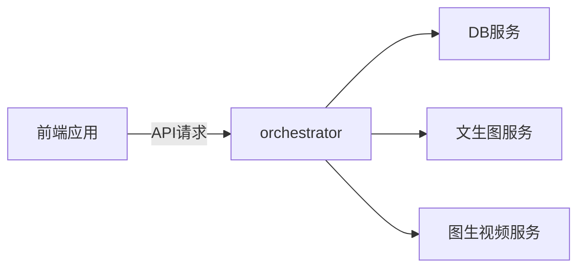

# aigc
study of aigc


# Agent 应用微服务架构设计

## 概述
本项目采用微服务架构，将 DB、头条、文生图和图生视频功能拆分为独立服务，遵循单一职责、松耦合和可扩展性原则。
```plaintext
/d:/ipanel/study/toutiao_video/            # 项目根目录
├── .gitignore                           # 忽略文件配置
├── README.md                            # 项目说明文件
├── mcps/                                # 微服务目录
│   ├── db-service/                      # 数据库服务
│   │   ├── main.py                      # 服务入口文件
│   │   └── pyproject.toml               # Python 项目配置
│   ├── news-service/                    # 头条服务
│   │   ├── main.py                      # 服务入口文件
│   │   └── pyproject.toml               # Python 项目配置
│   ├── image-service/                   # 文生图服务
│   │   ├── main.py                      # 服务入口文件
│   │   └── pyproject.toml               # Python 项目配置
│   └── video-service/                   # 图生视频服务
│       ├── main.py                      # 服务入口文件
│       └── pyproject.toml               # Python 项目配置
└── conf/                                # 配置文件目录
    └── common_config.py                 # 公共配置文件
```


## 目录结构
```plaintext
/mcps
├── db-service               # 数据库服务代码目录
├── news-service             # 头条服务代码目录
├── image-service            # 文生图服务代码目录
├── video-service            # 图生视频服务代码目录
└── readme.md                # mcp 的启动方式文档
```


## 技术栈选型
- **数据库**：SQLite3（轻量级）或 MySQL（分布式扩展）
- **服务框架**：Node.js (Express) / Python (Flask/Django)

## 服务详情
```bash
# 启动数据库服务
cd d:/ipanel/study/toutiao_video/mcps/db-service
uvicorn main.py --host 0.0.0.0 --port 8001

# 启动头条服务（需自行实现）
cd d:/ipanel/study/toutiao_video/mcps/news-service
uvicorn main.py --host 0.0.0.0 --port 8004

# 启动文生图服务（需自行实现）
cd d:/ipanel/study/toutiao_video/mcps/image-service
uvicorn main.py --host 0.0.0.0 --port 8002

# 启动图生视频服务（需自行实现）
cd d:/ipanel/study/toutiao_video/mcps/video-service
uvicorn main.py --host 0.0.0.0 --port 8003
```

### 数据库服务 (db-service)
#### 职责
- 新闻数据的增删改查（CRUD）操作
- 数据索引与查询优化
- 数据持久化与备份

#### 启动方式
```bash
cd db-service
uv main.py --host 0.0.0.0 --port 8001
```

### 文生图服务 (image-service)
#### 职责
- 接收文本描述，生成对应的静态图像
- 图像风格控制与参数配置
- 图像存储与 URL 管理

#### 启动方式
```bash
cd image-service
uvicorn main.py --host 0.0.0.0 --port 8002
```

### 图生视频服务 (video-service)
#### 职责
- 静态图片转视频（含转场、特效）
- AI 视频生成（文本驱动动态画面）
- 视频格式转换与剪映兼容处理

#### 启动方式
```bash
cd video-service
uvicorn main.py --host 0.0.0.0 --port 8003
```

## 服务通信架构


        